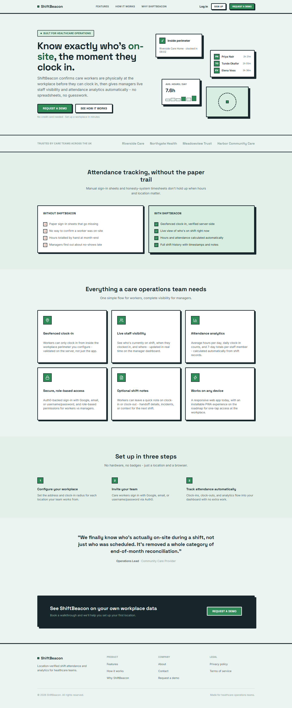
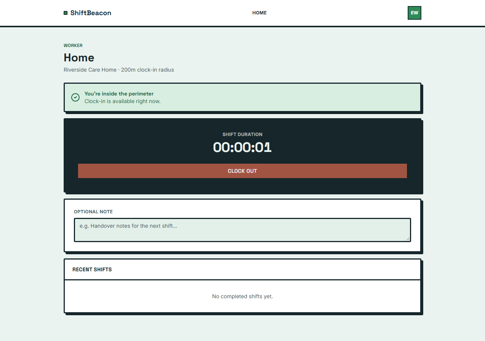
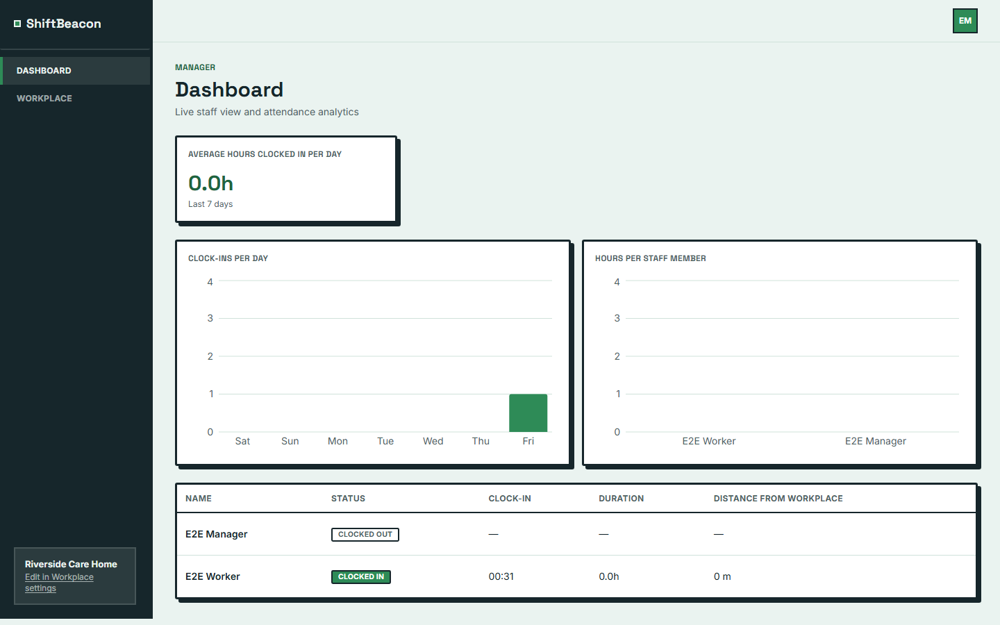
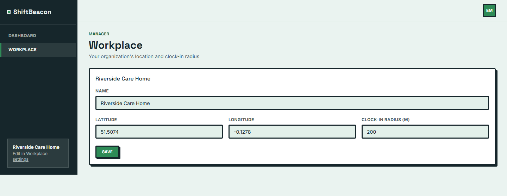
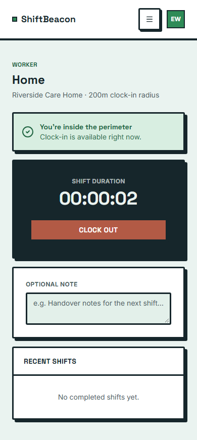
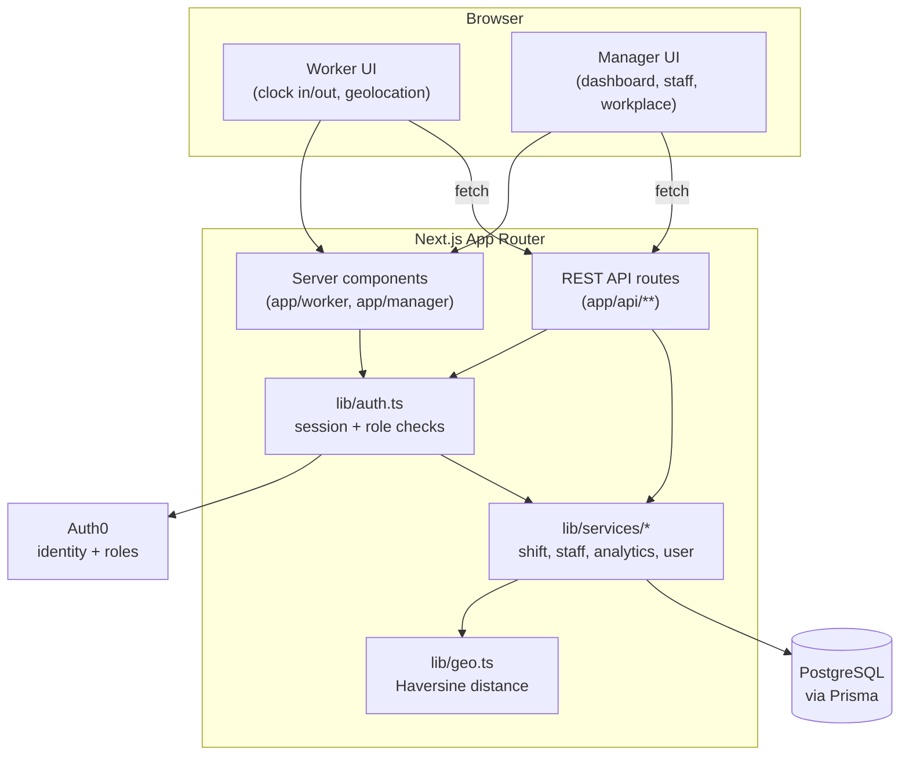
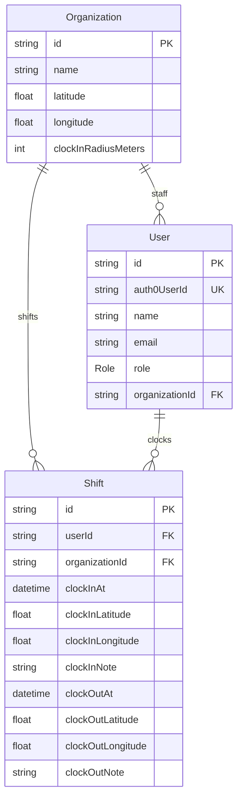

# ShiftBeacon

A location-aware shift management app for healthcare teams. Care workers clock
in and out from within a manager-configured workplace perimeter (geofence);
managers get live visibility into who's on site, full shift history, and
attendance analytics.


## Why

Manual sign-in sheets and honesty-system timesheets don't hold up when hours
and location matter. ShiftBeacon confirms a care worker is physically at the
workplace before they're allowed to clock in - validated server-side, never
trusting the client - then gives managers a live view of who's on shift and
automatic attendance analytics, with no spreadsheets involved.

## Screenshots

| Marketing landing page | Worker - active shift |
|---|---|
|  |  |

| Manager dashboard | Workplace / geofence config |
|---|---|
|  |  |

<details>
<summary>Worker view on mobile</summary>



</details>

## Features

- **Geofenced clock-in** - workers can only clock in from inside the
  configured workplace perimeter; the browser's reported location is
  independently re-validated server-side against the organization's stored
  coordinates and radius (Haversine distance), never trusting a client-sent
  in/out flag.
- **Live staff visibility** - managers see who's currently clocked in, since
  when, and how far from the workplace, updated in real time.
- **Attendance analytics** - average hours/day, daily clock-in counts, and
  7-day per-staff hours, computed directly from shift records.
- **Shift history** - every clock-in/out with timestamps, coordinates, and
  optional notes, for both workers (their own history) and managers (any
  staff member's, scoped to their organization).
- **Role-based access** - Auth0-backed sign-in (username/password, Google, or
  email) with `CARE_WORKER` / `MANAGER` roles enforced server-side on every
  protected route, not just hidden in the UI.
- **Installable PWA** - installable app shell with an offline fallback page
  (no offline clock-in implied - geolocation and the API both require a live
  connection).

## Architecture



**Request flow for clock-in**: the browser captures a GPS reading, sends it to
`POST /api/shifts/clock-in`, the route resolves the authenticated user and
their organization via the Auth0 session, and the service layer independently
recomputes the distance to the organization's stored coordinates before
creating the shift - a client-reported "I'm inside the perimeter" is never
trusted on its own.

### Data model



An active shift is a `Shift` row with `clockOutAt = null`; a worker can only
have one at a time.

## Tech stack

| Layer | Choice |
|---|---|
| Framework | Next.js (App Router), React, TypeScript (strict, no `any`) |
| Styling | Tailwind CSS v4 + shadcn/ui, cooled-down neobrutalist design system |
| Data | PostgreSQL + Prisma ORM |
| Identity | Auth0 (username/password, Google, email), roles via a namespaced session claim |
| Validation | Zod on every API input |
| Charts | Recharts |
| Unit/API/component tests | Vitest + React Testing Library |
| End-to-end tests | Playwright |

## Getting started

**Prerequisites:** Node.js, Docker (for local Postgres), an Auth0 tenant.

```bash
git clone https://github.com/arkaslittlemind/ShiftBeacon.git
cd ShiftBeacon
npm install

cp .env.example .env.local
# fill in AUTH0_* and DATABASE_URL - see Environment variables below

docker compose up -d          # Postgres on localhost:51214
npx prisma migrate dev
npx prisma db seed            # optional: one org + a worker/manager

npm run dev                   # http://localhost:3000
```

### Environment variables

| Variable | Used for |
|---|---|
| `AUTH0_DOMAIN`, `AUTH0_CLIENT_ID`, `AUTH0_CLIENT_SECRET`, `AUTH0_SECRET` | Auth0 SDK configuration |
| `APP_BASE_URL` | Auth0 callback/logout base URL (`http://localhost:3000` locally) |
| `DATABASE_URL` | PostgreSQL connection string |
| `E2E_WORKER_EMAIL`, `E2E_WORKER_PASSWORD`, `E2E_MANAGER_EMAIL`, `E2E_MANAGER_PASSWORD` | Playwright e2e suite only - real Auth0 test accounts (the manager account needs `app_metadata.role = "MANAGER"` in the Auth0 dashboard) |

All required variables are validated at startup/build time; the app fails
fast with a clear error if one is missing.

## Commands

| Command | Does |
|---|---|
| `npm run dev` | Start the dev server at `http://localhost:3000` |
| `npm run build` | Production build |
| `npm run start` | Run Prisma migrations, then start the production server |
| `npm run lint` | ESLint |
| `npm test` | Unit/API/component tests (Vitest) |
| `npm run test:e2e` | End-to-end tests (Playwright, Chromium) |
| `docker compose up -d` | Start local Postgres (`localhost:51214`) |

## Testing

- **Unit + API + component tests** (Vitest, 109 tests): the Haversine
  geofence utility and its boundary cases, shift duration formatting,
  analytics calculations, Zod validation schemas, authorization on every
  protected API route, clock-in/out business rules (perimeter rejection,
  duplicate active shift), and organization isolation between managers.
- **End-to-end tests** (Playwright): the full worker clock-in/out journey,
  manager staff drill-down, and manager workplace configuration, against a
  real Auth0 login.

## Project structure

```
app/            Next.js App Router - pages, layouts, and REST API routes
components/     Worker/manager UI components + shadcn/ui primitives
lib/            Auth, Prisma client, service layer, geofence math, validation
prisma/         Schema, migrations, seed data
e2e/            Playwright end-to-end specs
```

## Deployment

Targets Vercel for the app and a managed PostgreSQL instance, with Prisma
migrations running as part of the deploy (`prisma migrate deploy`) and
separate Auth0 callback/logout URLs for development and production. HTTPS is
required in production - browser geolocation needs a secure context.

## Status

Feature-complete MVP: authentication, geofenced clock-in/out, shift history,
manager live staff view and analytics dashboard, responsive/accessibility
polish, installable PWA shell, full test coverage, and production deployment.
Automatic background geofence entry/exit detection was evaluated and shelved
after a feasibility spike showed it isn't reliably achievable as a web/PWA
feature (background location APIs are suspended once the screen locks or the
app closes); it would need a native app with real OS-level geofencing.
